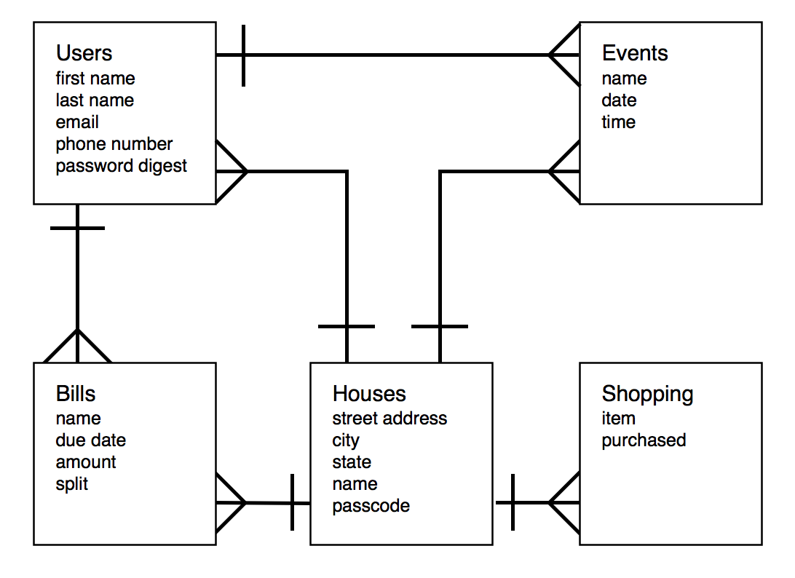

##[RoommateHub](http://roommatehub.herokuapp.com)

GA WDI NYC Jan 14, Project 3

###Description

This is an app to help roommmates keep track of household bills, events, etc. Users can text the website to get and send information.

###Technologies Used

* Ruby 2.1.0
* Ruby on Rails 4.0.2
* PostgreSQL Database
* JavaScript
* jQuery
* Backbone
* Authentication & Authorization using [bcrypt-ruby](http://bcrypt-ruby.rubyforge.org/)
* [Twilio](http://www.twilio.com/)

###User Stories

Check out the user stories on [PivotalTracker](https://www.pivotaltracker.com/s/projects/1052366).

###ERD

